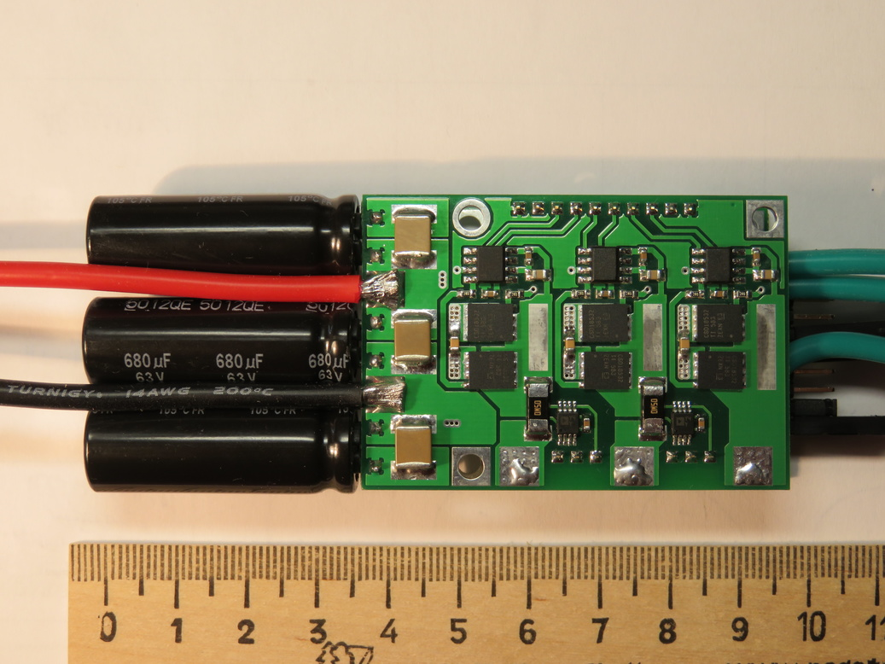
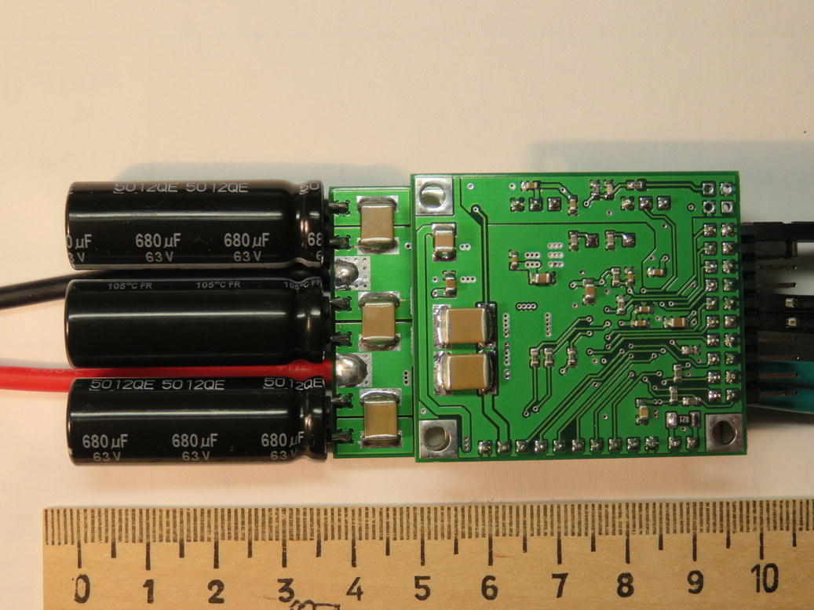

# Phobia Motor Controller

PMC is an open project that aims to build the quality three-phase BLDC motor
controller for RC.

## Hardware specification (rev2)

* Separate power and control PCB.
* Dimension: 90mm x 40mm x 15mm.
* Weight: 50g (wires not included).
* Single supply from 5v to 42v.
* Phase current up to 50A.
* Computation core is STM32F405RG, typical load is about 59% at 60kHz PWM.
* Power MOSFETs are CSD18532Q5B, 60v, 2.5 mOhm, actual switching time is about 50ns.
* Two current sensing shunts 0.5 mOhm, amplifiers are AD8417.
* Measurement of supply voltage, external voltage input.
* Temperature measurement using NTC resistor.
* Interface to a quadrature encoder or hall sensors.
* Managed through USART or CAN.
* Also SWD, DAC/ADC, BOOT/RESET pins are available.
* Anti-spark circuit: No.
* Reverse polarity protection: No.
* Overcurrent protection: No (implemented in software).

Look into [phobia-pcb](https://bitbucket.org/amaora/phobia-pcb) repository for
PCB design source files.

## Software features

* Sensor-less vector control. All the code of motor control was written from
  scratch, no external libs are used, portable as it is C code.
* Advanced PWM scheme to reduce switching losses and fully utilise DC bus.
* Fast and robust rotor position estimation algorithm based on Luenberger
  observer with a bit of gain scheduling.
* Operation at low or zero speed using HFI. But it requires a motor with
  magnetic saliency.
* Torque control, most simple.
* Speed and absolute position control, servo operation (EXPERIMENTAL).
* Power control and limiting.
* All of functions are available from command line interface.
* Automated motor parameters identification, no additional tools are needed.
* Some simple motor failures as open circuit or winding short can be detected.
* BEMF waveform online estimation (EXPERIMENTAL).
* Operation at current values outside the sensor range (EXPERIMENTAL).

* Non critical tasks are managed by [FreeRTOS](http://www.freertos.org/).
* Flash storage for all of configurable parameters.

## TODO

* Analyse of rapid transient modes.
* Implement an application protocol via CAN.
* Make a detailed documentation.

## Current Status

A significant part of the functions are already implemented in software.
However, there are still many issues have no resolution or have experimental
status.

There are a few videos show the operation of the prototypes (outdated).

