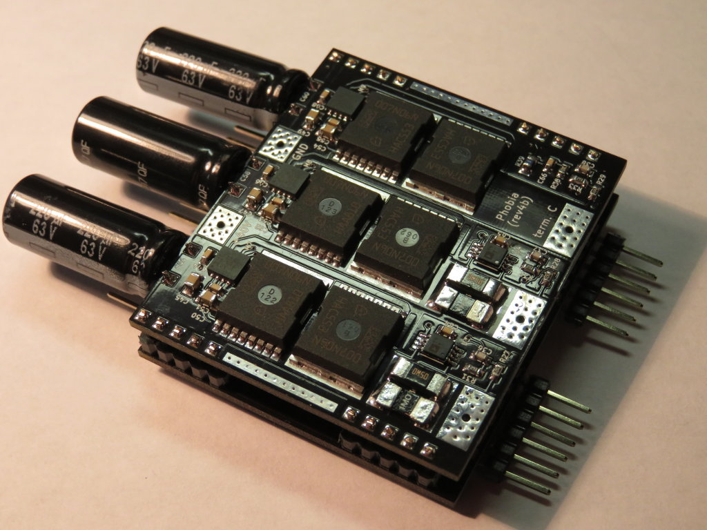

# Phobia Motor Controller

PMC is an open project that aims to build the quality three-phase BLDC motor
controller for RC and robotics.

## Hardware specification (rev4b)

* Dimension: 70mm x 50mm x 15mm.
* Weight: 40g.
* Single supply from 6v to 50v.
* Phase current up to 75A (IPT007N06N, 60v, 0.75 mOhm).
* Lightweight capacitor bank (3 x 2.2uF + 3 x 220uF).
* PWM frequency from 20 to 80 kHz.
* Sensors:
	* Two current shunts (0.33 mOhm) with amplifiers (AD8417) give a measuring range of 75A.
	* Supply voltage from 0 to 60v.
	* Three terminal voltages from 0 to 60v.
	* Temperature of PCB with NTC resistor.
* Interfaces:
	* Hall sensors or incremental encoder (5v pull-up).
	* External NTC resistor (e.g. motor temperature control).
	* CAN with optional termination resistor on PCB (3.3v).
	* USART to bootload and configure (3.3v).
	* Combined port: SPI, ADC, DAC, GPIO (3.3v).
	* Combined port: I2C, PPM, USART, GPIO (3.3v pull-up).
	* BOOT and RESET pins to use embedded bootloader.
	* SWD to hardware debug.
* Power:
	* Supply to 5v buck (up to 1A).
	* 5v to 12v boost (up to 100 mA but mosfet drivers can consume all of this current).
	* 5v to 3.3v ldo (up to 400 mA).
	* 5v to 3.3vREF optional reference voltage (accuracy 0.2%, 25 mA).
* STM32F4xx microcontroller (60% typical computational load).
* Anti-spark circuit: No.
* Reverse polarity protection: No.
* Overcurrent protection: Implemented in software.

Look into [phobia-pcb](https://bitbucket.org/amaora/phobia-pcb) repository for
PCB design source files.

## Software features

* Sensorless vector control. All the code of motor control was written from
  scratch, no external libs are used, portable as it is plain C code.
* Advanced PWM scheme to reduce switching losses and fully utilise DC bus.
* Fast and robust flux linkage estimation algorithm based on Luenberger
  observer with gain scheduling.
* Operation at low or zero speed:
	* Forced control that applies a current vector without feedback to force rotor turn.
	* High frequency injection (HFI) based on magnetic saliency.
	* Hall sensors or incremental encoder (**TODO**).
* Control loops:
	* Torque control through current control loop is always enabled.
	* Simple speed PI control loop.
	* Servo operation (**TODO**).
* Adjustable limits:
	* Phase current (with adjustable derate from overheat).
	* Power consumption and regeneration.
 	* Maximal speed and acceleration.
* Automated motor parameters identification with no additional tools.
* Self test of hardware to diagnose troubles (**TODO**).
* Smooth start when the motor is already running (**TODO**).
* Advanced command line interface with autocompletion and history.
* Operation at current values outside the sensor range (**EXPERIMENTAL**).
* Two phase machine support (e.g. bipolar stepper) (**EXPERIMENTAL**).
* Non critical tasks are managed by [FreeRTOS](http://www.freertos.org/).
* Flash storage for all of configurable parameters.

## TODO

* Try to estimate stator windings resistance with KF.
* Analyse of rapid transient modes. Introduce an iron saturation model if needed.
* Implement an application protocol via CAN.
* Make a detailed documentation.

## Current Status

Now we can declare that PMC is ready to use in most applications. But there is
still a lot of unresolved issues. It may be difficult to configure the PMC for
a specific motor.

There are a few videos that show the operation of the prototypes (may be outdated).

Read more in [Getting Started](doc/GettingStarted.md).

