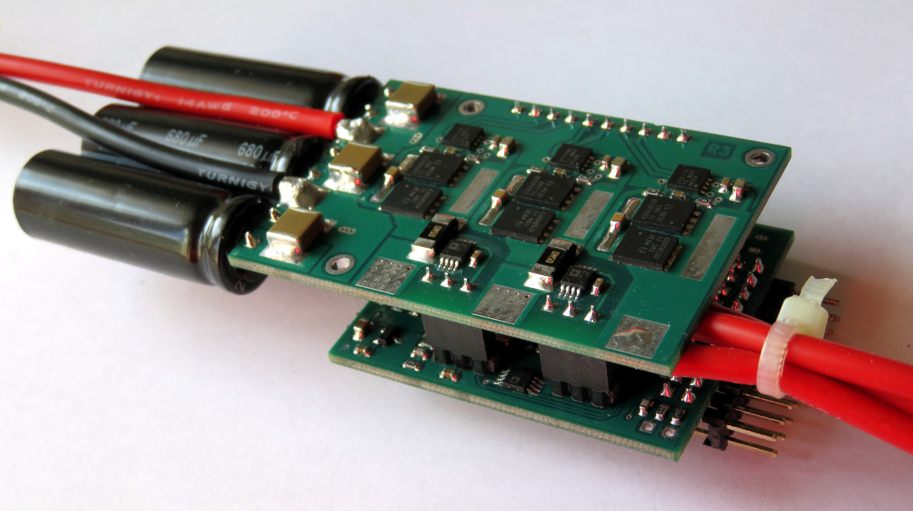

# Phobia Motor Controller

PMC is an open project that aims to build the quality three-phase BLDC motor
controller for RC and robotics.

We develop PMC with hope that it could be applicable to the various cases. We
implement only the vector control as we think this is only right way. You may
want to consider PMC as a platform for experimentation with motor control
techniques. Or you could just use PMC in your application. In any case, we
are pleased to offer our solution in the field of motor control.

## Hardware specification (rev3)

* Separate power and control PCB.
* Dimension: 90mm x 40mm x 15mm.
* Weight: 50g (wires not included).
* Single supply from 5v to 42v.
* Phase current up to 50A.
* Computation core is STM32F405RG, typical load is about 59% at 60kHz PWM.
* Power MOSFETs are CSD18532Q5B, 60v, 2.5 mOhm, actual switching time is about 50ns.
* Two current sensing shunts 0.5 mOhm, amplifiers are AD8417.
* Measurement of supply voltage, external voltage input.
* Temperature measurement with NTC resistor.
* Interface to a quadrature encoder or hall sensors.
* Managed through USART or CAN.
* Also SWD, DAC/ADC, BOOT/RESET pins are available.
* Anti-spark circuit: No.
* Reverse polarity protection: No.
* Overcurrent protection: No (implemented in software).

Look into [phobia-pcb](https://bitbucket.org/amaora/phobia-pcb) repository for
PCB design source files.

## Software features

* Sensorless vector control. All the code of motor control was written from
  scratch, no external libs are used, portable as it is C code.
* Advanced PWM scheme to reduce switching losses and fully utilise DC bus.
* Fast and robust rotor position estimation algorithm based on Luenberger
  observer with a bit of gain scheduling.
* Operation at low or zero speed using HFI. But it requires a motor with
  magnetic saliency.
* Torque control, most simple.
* Speed and absolute position control, servo operation (EXPERIMENTAL).
* Power control and limiting.
* All of functions are available from command line interface.
* Automated motor parameters identification, no additional tools are needed.
* Some simple motor failures as open circuit or winding short can be detected.
* BEMF waveform online estimation (EXPERIMENTAL).
* Operation at current values outside the sensor range (EXPERIMENTAL).
* Non critical tasks are managed by [FreeRTOS](http://www.freertos.org/).
* Flash storage for all of configurable parameters.

## TODO

* Analyse of rapid transient modes. Introduce an iron saturation model.
* Implement an application protocol via CAN.
* Make a detailed documentation.

## Current Status

Now we can declare that PMC is ready to use in most applications. But there is
still a lot of unresolved issues. It may be difficult to configure the PMC for
a specific motor.

There are a few videos that show the operation of the prototypes (may be outdated).

Read more in [Getting Started](doc/GettingStarted.md).

